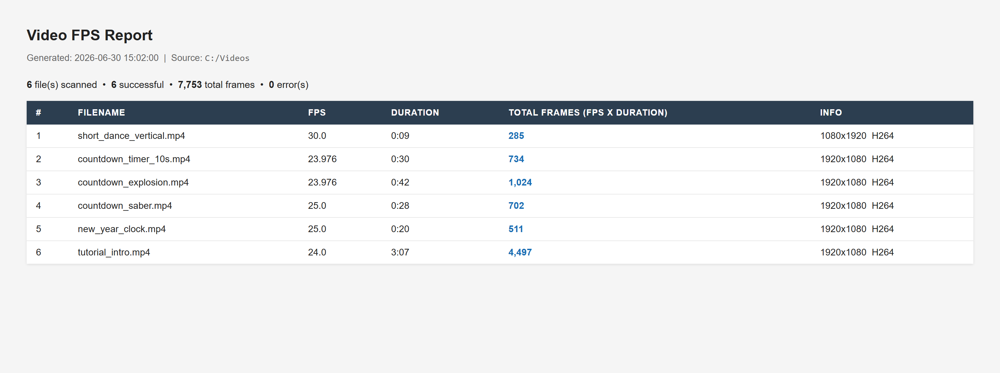

# Video FPS Calculator

A small Windows tool that reads the **frame rate** and **duration** of your video
files (via [FFmpeg's `ffprobe`](https://ffmpeg.org/)), calculates the **total number
of frames** (`FPS × duration`), and produces a clean, shareable **HTML report**.

It works on a single video or recursively across an entire folder, and comes in two
flavors: a simple command-line script and a compact graphical app.

---

## Download (no setup required)

If you just want to run it on Windows, grab the standalone executable from the
**[Releases](../../releases)** page:

1. Open the latest release.
2. Download **`VideoFPSCalculator.exe`**.
3. Double-click it — that's it.

`ffprobe` is bundled inside the executable, so you do **not** need to install
anything else.

---

## Screenshots / Output

The tool generates an HTML report like the one in
[`sample_report.html`](sample_report.html):



| # | Filename | FPS | Duration | Total Frames | Info |
|---|----------|-----|----------|--------------|------|
| 1 | short_dance_vertical.mp4 | 30.0 | 0:09 | 285 | 1080x1920 H264 |
| 2 | countdown_timer_10s.mp4 | 23.976 | 0:30 | 734 | 1920x1080 H264 |
| 3 | countdown_explosion.mp4 | 23.976 | 0:42 | 1,024 | 1920x1080 H264 |
| 4 | countdown_saber.mp4 | 25.0 | 0:28 | 702 | 1920x1080 H264 |
| 5 | new_year_clock.mp4 | 25.0 | 0:20 | 511 | 1920x1080 H264 |
| 6 | tutorial_intro.mp4 | 24.0 | 3:07 | 4,497 | 1920x1080 H264 |

---

## Running from source

### Requirements

- **Python 3.10+**
- **FFmpeg** installed and `ffprobe` available on your `PATH`
  (download from <https://ffmpeg.org/download.html>).

The tool uses only the Python standard library — there are no `pip` packages to
install. The GUI uses Tkinter, which ships with the standard Python installer on
Windows.

### Command line

```bash
python fps_calculator.py <video_file_or_folder> [output.html]
```

Examples:

```bash
# Analyze one file, write the default fps_report.html
python fps_calculator.py "C:\Videos\clip.mp4"

# Analyze a whole folder and choose the output name
python fps_calculator.py "C:\Videos" "report.html"
```

### Graphical app

```bash
python fps_calculator_gui.py
```

Pick a file or folder, choose where to save the report, and click **Analyze**.

---

## Supported formats

`.mp4` `.mkv` `.avi` `.mov` `.wmv` `.flv` `.webm` `.m4v` `.ts` `.mpg` `.mpeg`

---

## Building the executable yourself

The Windows `.exe` is built with [PyInstaller](https://pyinstaller.org/) using the
included [`VideoFPSCalculator.spec`](VideoFPSCalculator.spec). Place a copy of
`ffprobe.exe` next to the spec file, then run:

```bash
pip install pyinstaller
pyinstaller VideoFPSCalculator.spec
```

The standalone executable will appear in the `dist/` folder.

> **Note:** `ffprobe.exe` is part of FFmpeg and is **not** included in this
> repository. Download it from <https://ffmpeg.org/download.html> when building.

---

## License

Released under the [MIT License](LICENSE).
